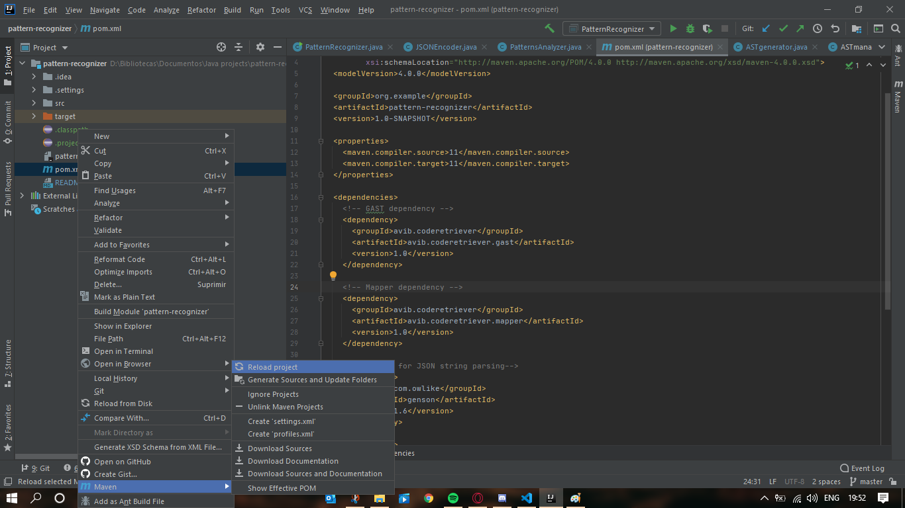
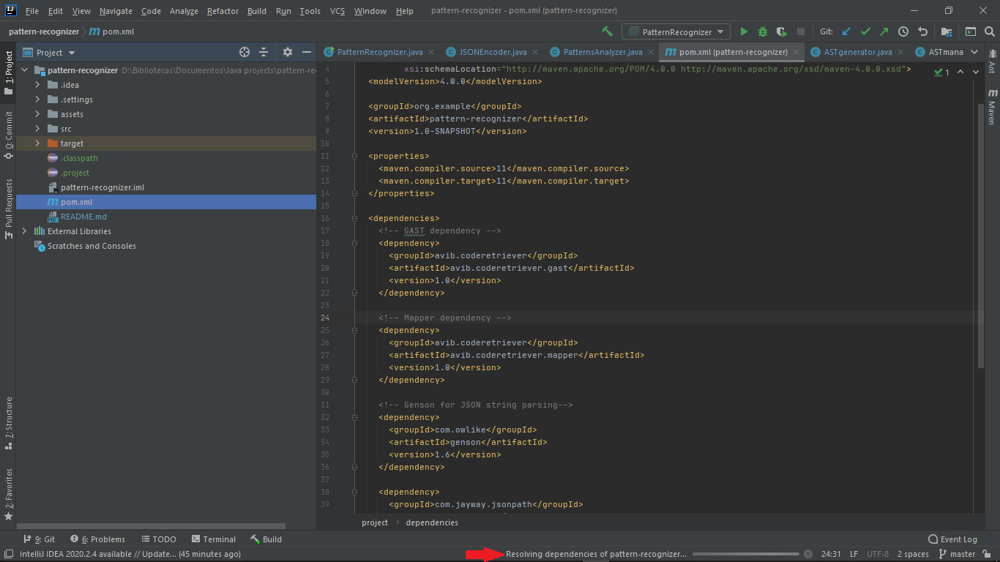
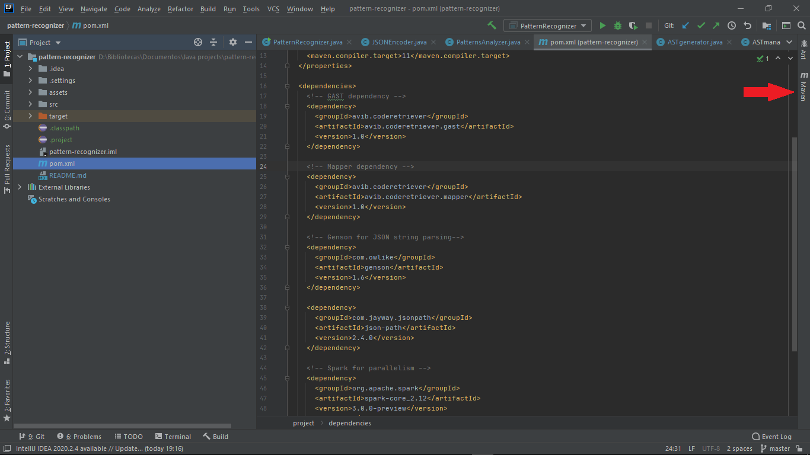
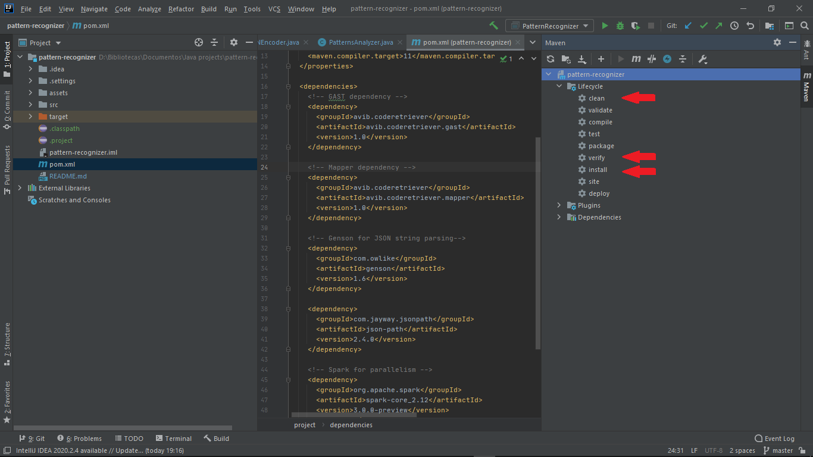

# Patter Recognizer for Java Source Code

The main purpose of this project is take any Java source code and check if it use at least one programming design pattern

## Content

- [Setting up the enviroment](#Setting-up-the-enviroment)
- [Code Overview](#code-overview)

## Setting up the enviroment:

1. Download and install [JRE](https://www.java.com/es/download/) and [JDK](https://www.oracle.com/technetwork/es/java/javase/downloads/index.html). to run Java projects.

2. Download and install [IDEA IntelliJ](https://www.jetbrains.com/es-es/idea/download/#section=windows) IDE for Java development.

3. Ask for access to GAST core and GAST Mapper repositories.

4. Once you have access, clone the repositories on your PC and open in different IDEA IDE windows.

5. Install maven dependencies of both projects. If you don't know how to install maven dependencies [see this](#installing-maven-dependencies-using-IDEA-UI)

6. Install the maven packages of each project (this is necesary to run the pattern recognizer). If you don't know how to install maven packages [see this](#installing-maven-packages-using-IDEA-UI)

7. Clone pattern recognizer repository on your PC

## Installing Maven dependencies using IDEA UI:

1. Find `pom.xml` file of the project and push right click button and follow Maven -> Reload project

   

2. It will install automatically all the dependencies of your project.

   

3. If you want to add new dependencies, add it in the `pom.xml` file and repeat steps 1 y 2

## Installing Maven packages using IDEA UI:

1. Open Maven panel by clicking on "Maven" button on the right

   

2. Then, run `clean`, `verify` and `install` process in order and wait until they finish.

   

## Code Overview
